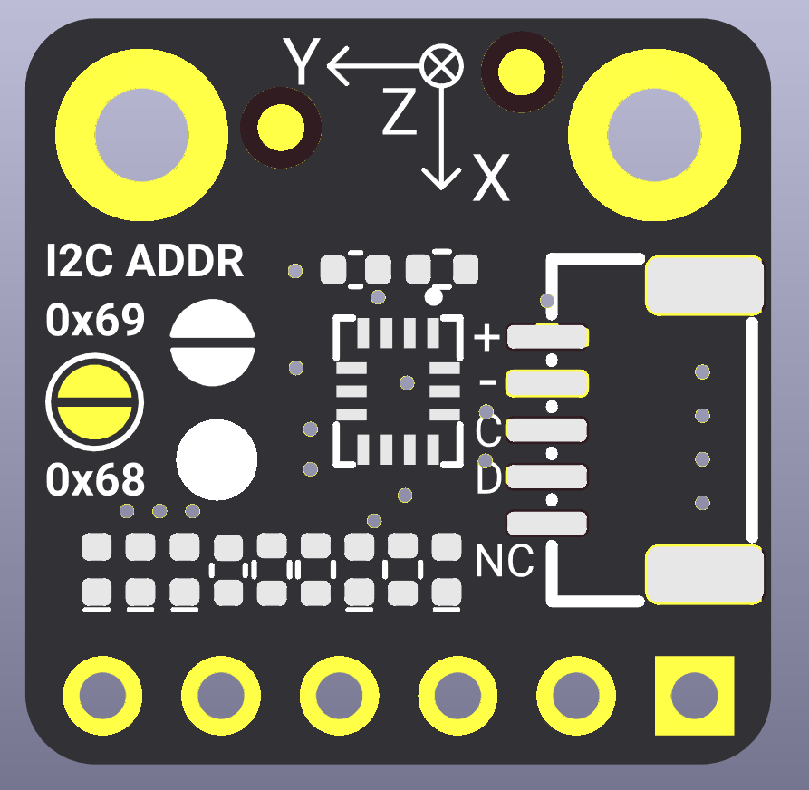
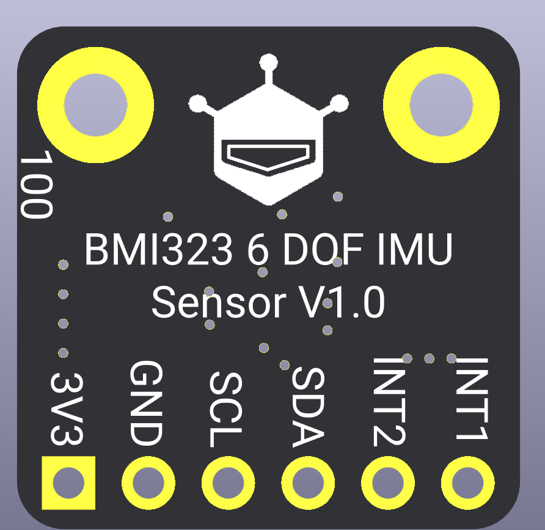

# DFRobot_BMI323
- [English Version](./README.md)

BMI323 是一款低功耗、高性能的 6 轴 IMU 传感器，集成了 3 轴加速度计和 3 轴陀螺仪。它通过 I2C 接口通信，提供全面的运动检测功能，包括计步、任意运动检测、无运动检测、显著运动检测、敲击检测、倾斜检测、方向检测和平面检测。

该传感器非常适合可穿戴设备、智能手表、健身追踪器和物联网应用，这些应用对运动感知和能效要求很高。BMI323 具有基于硬件的运动检测算法，可独立运行，无需 MCU 持续干预即可实现超低功耗。通过可配置的中断引脚（INT1 和 INT2），传感器可以高效地通知主机系统运动事件，非常适合电池供电的应用。

**主要特性：**

- 6 轴运动感知（3 轴加速度计 + 3 轴陀螺仪）
- 硬件计步器，支持中断
- 多种运动检测模式（任意运动、无运动、显著运动）
- 手势识别（敲击、倾斜、方向、平面检测）
- 可配置输出数据速率（ODR），从 0.78Hz 到 6400Hz
- 多种工作模式（低功耗、普通、高性能）
- I2C 接口，可配置地址（0x68/0x69）
- 双中断引脚，灵活的事件处理

<p align="center">
  
  
</p>


## 产品链接 (https://www.dfrobot.com)
    SKU: SEN0693

## 目录

  * [概述](#概述)
  * [库安装](#库安装)
  * [方法](#方法)
  * [兼容性](#兼容性)
  * [历史](#历史)
  * [创作者](#创作者)

## 概述

本 Arduino 库为 BMI323 6 轴 IMU 传感器提供全面的接口。它支持：

**基本功能：**

- 通过 I2C 接口初始化传感器
- 配置加速度计和陀螺仪参数（ODR、量程、工作模式）
- 同时读取 6 轴传感器数据（加速度计 + 陀螺仪）

**高级功能：**

- 计步器，支持中断
- 任意运动检测中断
- 无运动检测中断
- 显著运动检测中断
- 平面检测中断
- 方向检测中断（横竖屏、正反面）
- 敲击检测中断（单击/双击/三击）
- 倾斜检测中断

所有运动检测功能都支持可配置阈值，并可映射到 INT1 或 INT2 中断引脚，实现灵活的系统集成。

## 库安装

要使用本库，请先下载库文件，将其粘贴到 \Arduino\libraries 目录，然后打开 examples 文件夹并运行其中的示例程序。

## 方法

```C++
  /**
   * @fn DFRobot_BMI323
   * @brief 构造函数
   * @details 构造函数 - I2C 接口
   * @param wire TwoWire 对象指针，默认为 &Wire
   * @param i2cAddr I2C 地址，默认为 0x69
   * @return 无
   */
  DFRobot_BMI323(TwoWire *wire = &Wire, uint8_t i2cAddr = 0x69);

  /**
   * @fn begin
   * @brief 初始化函数
   * @details 初始化 I2C 接口、芯片寄存器和功能上下文
   * @param 无
   * @return bool 类型，表示初始化状态
   * @retval true 初始化成功
   * @retval false 初始化失败
   */
  bool begin(void);

  /**
   * @fn configAccel
   * @brief 配置加速度计
   * @param odr 输出数据速率选择（参见：eAccelODR_t）
   * @n 可用速率：
   * @n - eAccelODR0_78125Hz:  0.78125 Hz
   * @n - eAccelODR1_5625Hz:   1.5625 Hz
   * @n - eAccelODR3_125Hz:    3.125 Hz
   * @n - eAccelODR6_25Hz:     6.25 Hz
   * @n - eAccelODR12_5Hz:     12.5 Hz
   * @n - eAccelODR25Hz:       25 Hz
   * @n - eAccelODR50Hz:       50 Hz
   * @n - eAccelODR100Hz:      100 Hz
   * @n - eAccelODR200Hz:      200 Hz
   * @n - eAccelODR400Hz:      400 Hz
   * @n - eAccelODR800Hz:      800 Hz
   * @n - eAccelODR1600Hz:     1600 Hz
   * @n - eAccelODR3200Hz:     3200 Hz
   * @n - eAccelODR6400Hz:     6400 Hz
   * @n @note ODR 范围限制（基于工作模式）：
   * @n - 低功耗模式：0.78Hz ~ 400Hz
   * @n - 普通模式：12.5Hz ~ 6400Hz
   * @n - 高性能模式：12.5Hz ~ 6400Hz
   * @param range 量程选择（参见：eAccelRange_t）
   * @n 可用量程：
   * @n - eAccelRange2G:   ±2g
   * @n - eAccelRange4G:   ±4g
   * @n - eAccelRange8G:   ±8g
   * @n - eAccelRange16G:  ±16g
   * @param mode 工作模式选择（参见：eAccelMode_t），默认为 eAccelModeNormal
   * @n 可用模式：
   * @n - eAccelModeLowPower:  低功耗模式
   * @n - eAccelModeNormal:    普通模式（默认）
   * @n - eAccelModeHighPerf:  高性能模式
   * @return bool 类型，表示配置状态
   * @retval true 配置成功
   * @retval false 配置失败
   */
  bool configAccel(eAccelODR_t odr, eAccelRange_t range, eAccelMode_t mode = eAccelModeNormal);

  /**
   * @fn configGyro
   * @brief 配置陀螺仪
   * @param odr 输出数据速率选择（参见：eGyroODR_t）
   * @n 可用速率：
   * @n - eGyroODR0_78125Hz: 0.78125 Hz
   * @n - eGyroODR1_5625Hz:  1.5625 Hz
   * @n - eGyroODR3_125Hz:   3.125 Hz
   * @n - eGyroODR6_25Hz:    6.25 Hz
   * @n - eGyroODR12_5Hz:    12.5 Hz
   * @n - eGyroODR25Hz:      25 Hz
   * @n - eGyroODR50Hz:      50 Hz
   * @n - eGyroODR100Hz:     100 Hz
   * @n - eGyroODR200Hz:     200 Hz
   * @n - eGyroODR400Hz:     400 Hz
   * @n - eGyroODR800Hz:     800 Hz
   * @n - eGyroODR1600Hz:    1600 Hz
   * @n - eGyroODR3200Hz:    3200 Hz
   * @n - eGyroODR6400Hz:    6400 Hz
   * @n @note ODR 范围限制（基于工作模式）：
   * @n - 低功耗模式：0.78Hz ~ 400Hz
   * @n - 普通模式：12.5Hz ~ 6400Hz
   * @n - 高性能模式：12.5Hz ~ 6400Hz
   * @param range 量程选择（参见：eGyroRange_t）
   * @n 可用量程：
   * @n - eGyroRange125DPS:   ±125dps
   * @n - eGyroRange250DPS:   ±250dps
   * @n - eGyroRange500DPS:   ±500dps
   * @n - eGyroRange1000DPS:  ±1000dps
   * @n - eGyroRange2000DPS:  ±2000dps
   * @param mode 工作模式选择（参见：eGyroMode_t），默认为 eGyroModeNormal
   * @n 可用模式：
   * @n - eGyroModeLowPower:  低功耗模式
   * @n - eGyroModeNormal:    普通模式（默认）
   * @n - eGyroModeHighPerf:  高性能模式
   * @return bool 类型，表示配置状态
   * @retval true 配置成功
   * @retval false 配置失败
   */
  bool configGyro(eGyroODR_t odr, eGyroRange_t range, eGyroMode_t mode = eGyroModeNormal);

  /**
   * @fn getAccelGyroData
   * @brief 同时读取加速度计和陀螺仪数据并返回物理单位
   * @details 一次性读取加速度计和陀螺仪原始数据，转换为 g/dps 并返回
   * @param accel 加速度计输出
   * @param gyro 陀螺仪输出
   * @return bool 类型，表示读取状态
   * @retval true 读取成功
   * @retval false 读取失败
   */
  bool getAccelGyroData(sSensorData *accel, sSensorData *gyro);

  /**
   * @fn getTemperature
   * @brief 读取芯片温度（摄氏度）
   * @details 从传感器读取温度原始值，并按官方公式换算：温度(°C) = (int16_t)raw / 512.0 + 23.0。
   * 需先配置加速度计或陀螺仪。
   * @return float 温度值（单位：°C）；若传感器未初始化或读取失败则返回 0.0f
   */
  float getTemperature(void);

  /**
   * @fn enableStepCounterInt
   * @brief 使能计步器中断功能
   * @details 配置计步器功能并映射到指定的中断引脚，当步数变化时将触发中断
   * @param pin 绑定的中断引脚（eINT1 或 eINT2）
   * @return bool 类型，表示配置状态
   * @retval true 配置成功
   * @retval false 配置失败
   */
  bool enableStepCounterInt(eInt_t pin);

  /**
   * @fn readStepCounter
   * @brief 读取计步器数据
   * @param stepVal 步数输出指针，读取的步数将写入该指针指向的内存
   * @return int8_t BMI3_OK 表示成功，其他值表示失败
   */
  int8_t readStepCounter(uint16_t *stepVal);

  /**
   * @fn getIntStatus
   * @brief 获取中断状态
   * @details 读取并合并 INT1 和 INT2 引脚的中断状态，返回值为 INT1 和 INT2 状态寄存器的 OR 组合。
   * @return uint16_t 合并的中断状态寄存器值（INT1 | INT2）。每一位代表不同的中断类型：
   * @n - BMI3_INT_STATUS_ANY_MOTION: 检测到任意运动
   * @n - BMI3_INT_STATUS_NO_MOTION: 检测到无运动
   * @n - BMI3_INT_STATUS_FLAT: 平面检测
   * @n - BMI3_INT_STATUS_ORIENTATION: 方向变化
   * @n - BMI3_INT_STATUS_STEP_DETECTOR: 检测到步数
   * @n - BMI3_INT_STATUS_SIG_MOTION: 检测到显著运动
   * @n - BMI3_INT_STATUS_TILT: 检测到倾斜
   * @n - BMI3_INT_STATUS_TAP: 检测到敲击
   */
  uint16_t getIntStatus(void);

  /**
   * @fn enableAnyMotionInt
   * @brief 配置任意运动阈值中断（使用官方结构体参数）
   * @param config 任意运动配置结构体（参见 bmi3_any_motion_config）
   * @n 参数说明：
   * @n - slope_thres: 加速度斜率阈值，范围
   * 0-4095，单位 1.953mg/LSB（官方示例：9 ≈ 17.6mg）
   * @n - hysteresis: 滞回值，范围 0-1023，单位 1.953mg/LSB（官方示例：5 ≈ 9.8mg）
   * @n - duration: 持续时间，范围 0-8191，单位 20ms（官方示例：9 = 180ms）
   * @n - acc_ref_up: 加速度参考更新模式，0=事件触发时，1=始终更新（官方示例：1）
   * @n - wait_time: 等待时间，范围 0-7，单位 20ms（官方示例：4-5 = 80-100ms）
   * @param pin 绑定的中断引脚
   * @param axisMask 轴选择掩码（默认：eAxisXYZ）
   * @return bool 类型，表示配置状态
   * @retval true 配置成功
   * @retval false 配置失败
   */
  bool enableAnyMotionInt(const struct bmi3_any_motion_config &config,
                          eInt_t pin, uint8_t axisMask = eAxisXYZ);

  /**
   * @fn enableNoMotionInt
   * @brief 配置无运动阈值中断（使用官方结构体参数）
   * @param config 无运动检测配置结构体（参见 bmi3_no_motion_config）
   * @n 参数说明：
   * @n - slope_thres: 加速度斜率阈值，范围
   * 0-4095，单位 1.953mg/LSB（官方示例：9 ≈ 17.6mg）
   * @n - hysteresis: 滞回值，范围 0-1023，单位 1.953mg/LSB（官方示例：5 ≈ 9.8mg）
   * @n - duration: 持续时间，范围 0-8191，单位 20ms（官方示例：9 = 180ms）
   * @n - acc_ref_up: 加速度参考更新模式，0=事件触发时，1=始终更新（官方示例：1）
   * @n - wait_time: 等待时间，范围 0-7，单位 20ms（官方示例：5 = 100ms）
   * @param pin 绑定的中断引脚
   * @param axisMask 轴选择掩码（默认：eAxisXYZ）
   * @return bool 类型，表示配置状态
   * @retval true 配置成功
   * @retval false 配置失败
   */
  bool enableNoMotionInt(const struct bmi3_no_motion_config &config, eInt_t pin,
                         uint8_t axisMask = eAxisXYZ);

  /**
   * @fn enableSigMotionInt
   * @brief 配置显著运动检测中断（使用官方结构体参数）
   * @param config 显著运动配置结构体（参见 bmi3_sig_motion_config）
   * @n 参数说明：
   * @n - block_size: 检测段大小，范围 0-65535（官方示例：200）
   * @n - peak_2_peak_min: 峰峰值加速度最小值，范围 0-1023（官方示例：30）
   * @n - peak_2_peak_max: 峰峰值加速度最大值，范围 0-1023（官方示例：30）
   * @n - mcr_min: 每秒平均交叉率最小值，范围 0-62（官方示例：0x10 = 16）
   * @n - mcr_max: 每秒平均交叉率最大值，范围 0-62（官方示例：0x10 = 16）
   * @param pin 绑定的中断引脚
   * @return bool 类型，表示配置状态
   * @retval true 配置成功
   * @retval false 配置失败
   */
  bool enableSigMotionInt(const struct bmi3_sig_motion_config &config,
                          eInt_t pin);

  /**
   * @fn enableFlatInt
   * @brief 配置平面检测中断（使用官方结构体参数）
   * @param config 平面检测配置结构体（参见 bmi3_flat_config）
   * @n 参数说明：
   * @n - theta: 最大允许倾斜角，范围 0-63，角度计算公式为 64 *
   * (tan(angle)^2)（官方示例：9）
   * @n - blocking: 阻塞模式，0=MODE_0(禁用)，1=MODE_1(>1.5g)，
   * 2=MODE_2(>1.5g 或斜率>半阈值)，3=MODE_3(>1.5g 或斜率>阈值)（官方示例：3）
   * @n - hold_time: 设备保持平面状态的最小持续时间，范围 0-255，单位 20ms（官方示例：50 = 1000ms）
   * @n - hysteresis: 平面检测的滞回角度，范围 0-255（官方示例：9）
   * @n - slope_thres: 连续加速度样本之间的最小斜率，范围 0-255（官方示例：0xCD = 205）
   * @param pin 绑定的中断引脚
   * @return bool 类型，表示配置状态
   * @retval true 配置成功
   * @retval false 配置失败
   */
  bool enableFlatInt(const struct bmi3_flat_config &config, eInt_t pin);

  /**
   * @fn enableOrientationInt
   * @brief 配置方向检测中断（使用官方结构体参数）
   * @param config 方向检测配置结构体（参见 bmi3_orientation_config）
   * @n 参数说明：
   * @n - ud_en: 是否检测翻转（正反面），0=禁用，1=使能（官方示例：1）
   * @n - hold_time: 方向变化检测所需的持续时间，范围 0-255，单位 20ms（官方示例：4 = 80ms）
   * @n - hysteresis: 方向检测的滞回值，范围 0-255（官方示例：5）
   * @n - theta: 最大允许倾斜角，范围 0-63，角度=64*(tan(angle)^2)（官方示例：16）
   * @n - mode: 方向检测模式，0/3=对称，1=高不对称，2=低不对称（官方示例：1）
   * @n - slope_thres: 防止剧烈运动导致误检测的斜率阈值，范围 0-255（官方示例：30）
   * @n - blocking: 阻塞模式，0-3（官方示例：3）
   * @param pin 绑定的中断引脚
   * @return bool 类型，表示配置状态
   * @retval true 配置成功
   * @retval false 配置失败
   */
  bool enableOrientationInt(const struct bmi3_orientation_config &config,
                            eInt_t pin);

  /**
   * @fn readOrientation
   * @brief 读取方向检测输出
   * @param portraitLandscape 横竖屏状态输出指针，可为 NULL
   * @param faceUpDown 正反面状态输出指针，可为 NULL
   * @return bool 类型，表示读取状态
   * @retval true 读取成功
   * @retval false 读取失败或功能未使能
   */
  bool readOrientation(uint8_t *portraitLandscape, uint8_t *faceUpDown);

  /**
   * @fn enableTapInt
   * @brief 配置敲击检测中断（使用官方结构体参数）
   * @param config 敲击检测配置结构体（参见 bmi3_tap_detector_config）
   * @n 关键参数（参考 tap.c）：
   * @n - axis_sel: 选择敲击检测的轴（0=X，1=Y，2=Z）
   * @n - mode: 检测模式（0=敏感，1=普通，2=稳健）
   * @n - tap_peak_thres / tap_shock_settling_dur 等用于确定敲击的时序/幅度阈值
   * @param pin 绑定的中断引脚
   * @param enableSingle 是否使能单击检测（默认 true）
   * @param enableDouble 是否使能双击检测（默认 true）
   * @param enableTriple 是否使能三击检测（默认 true）
   * @return bool 类型，表示配置状态
   * @retval true 配置成功
   * @retval false 配置失败
   */
  bool enableTapInt(const struct bmi3_tap_detector_config &config, eInt_t pin,
                    bool enableSingle = true, bool enableDouble = true,
                    bool enableTriple = true);

  /**
   * @fn readTapStatus
   * @brief 读取敲击检测状态（单击/双击/三击）
   * @param tapMask 输出掩码（可组合 BMI3_TAP_DET_STATUS_SINGLE/DOUBLE/TRIPLE）
   * @return bool 类型，表示读取状态
   * @retval true 读取成功
   * @retval false 读取失败
   */
  bool readTapStatus(uint8_t *tapMask);

  /**
   * @fn enableTiltInt
   * @brief 配置倾斜检测中断（使用官方结构体参数）
   * @param config 倾斜检测配置结构体（参见 bmi3_tilt_config）
   * @n 关键参数（参考 tilt.c）：
   * @n - segment_size: 用于平均参考向量的时间窗口，范围 0-255
   * @n - min_tilt_angle: 需要超过的最小倾斜角，范围 0-255，角度=256*cos(angle)
   * @n - beta_acc_mean: 低通平均系数，范围 0-65535
   * @param pin 绑定的中断引脚
   * @return bool 类型，表示配置状态
   * @retval true 配置成功
   * @retval false 配置失败
   */
  bool enableTiltInt(const struct bmi3_tilt_config &config, eInt_t pin);
```

## 兼容性

| MCU                | 运行良好 | 运行异常 | 未测试 | 备注 |
| ------------------ | :-----: | :------: | :----: | ---- |
| Arduino uno        |    √    |          |        |      |
| FireBeetle esp32   |    √    |          |        |      |
| FireBeetle esp8266 |    √    |          |        |      |
| FireBeetle m0      |    √    |          |        |      |
| Leonardo           |    √    |          |        |      |
| Microbit           |    √    |          |        |      |
| Arduino MEGA2560   |    √    |          |        |      |

## 历史

- Date 2025-12-08
- Version V1.0.0

## 创作者

Written by(Martin@dfrobot.com), 2025. (Welcome to our [website](https://www.dfrobot.com/))
